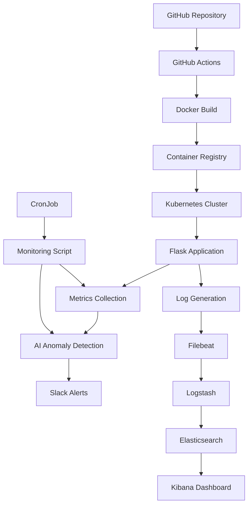

# 🧠 CerebrOps - AI-Powered CI/CD Monitoring System

[](https://github.com/YOUR_USERNAME/CerebrOps/actions/workflows/ci-cd.yml)
[](https://opensource.org/licenses/MIT)

CerebrOps is an intelligent CI/CD monitoring system that combines traditional monitoring with AI-powered anomaly detection to provide proactive alerts and insights for your development pipeline.

## 🎯 Features

- **🔍 Real-time Monitoring**: Continuous monitoring of application metrics and system health
- **🤖 AI Anomaly Detection**: Machine learning-based anomaly detection using Isolation Forest
- **📊 Comprehensive Dashboard**: Web-based dashboard with real-time metrics visualization  
- **🚨 Intelligent Alerting**: Smart Slack notifications with severity-based routing
- **📈 ELK Stack Integration**: Complete logging solution with Elasticsearch, Logstash, and Kibana
- **🚀 CI/CD Pipeline**: Automated testing, building, and deployment with GitHub Actions
- **🐳 Container Ready**: Full Docker and Kubernetes support
- **⚡ Performance Testing**: Automated load testing with k6
- **🔒 Security Scanning**: Built-in vulnerability scanning with Trivy

## 🏗️ Architecture



### Components Overview

- **Flask Application** (`app.py`): Main web application with health checks and metrics endpoints
- **AI Anomaly Detector** (`anomaly_detector.py`): Machine learning module for detecting system anomalies
- **Alert System** (`alerts.py`): Slack integration for intelligent notifications
- **Monitoring Orchestrator** (`monitor.py`): Main monitoring script that coordinates all components
- **ELK Stack**: Complete logging and visualization solution
- **CI/CD Pipeline**: Automated testing, building, and deployment workflow

## 🚀 Quick Start

### Prerequisites

- Docker and Docker Compose
- Python 3.11+
- kubectl (for Kubernetes deployment)
- Git

### 1. Clone the Repository

```bash
git clone https://github.com/YOUR_USERNAME/CerebrOps.git
cd CerebrOps
```

### 2. Set Up Environment Variables

Create a `.env` file in the project root:

```bash
# Slack Configuration
SLACK_WEBHOOK_URL=https://hooks.slack.com/services/YOUR/WEBHOOK/URL

# Application Configuration
APP_URL=http://localhost:5000
ENVIRONMENT=development

# ELK Configuration
ELASTICSEARCH_HOST=localhost:9200
KIBANA_HOST=localhost:5601
```

### 3. Start the ELK Stack

```bash
cd elk
docker-compose up -d
```

Wait for all services to be healthy (this may take a few minutes):

```bash
docker-compose ps
```

### 4. Build and Run the Application

```bash
# Build the Docker image
docker build -t cerebrops:latest .

# Run the application
docker run -d -p 5000:5000 --name cerebrops-app \
  -e SLACK_WEBHOOK_URL=$SLACK_WEBHOOK_URL \
  -v $(pwd)/logs:/app/logs \
  cerebrops:latest
```

### 5. Access the Dashboards

- **CerebrOps Dashboard**: http://localhost:5000
- **Kibana**: http://localhost:5601
- **Elasticsearch**: http://localhost:9200

### 6. Start Monitoring

```bash
# Install dependencies
pip install -r requirements.txt

# Run monitoring (single check)
python monitor.py --single-check

# Run continuous monitoring
python monitor.py --interval 60
```

## 🔧 Detailed Setup

### Local Development Setup

1. **Python Environment**:
   ```bash
   python -m venv venv
   source venv/bin/activate  # On Windows: venv\Scripts\activate
   pip install -r requirements.txt
   ```

2. **Run Tests**:
   ```bash
   pytest tests/ -v --cov=.
   ```

3. **Start Development Server**:
   ```bash
   python app.py
   ```

### Kubernetes Deployment

1. **Create Secrets**:
   ```bash
   # Create Slack webhook secret
   kubectl create secret generic cerebrops-secrets \
     --from-literal=slack-webhook-url='YOUR_WEBHOOK_URL'
   ```

2. **Deploy Application**:
   ```bash
   kubectl apply -f k8s/
   ```

3. **Check Deployment Status**:
   ```bash
   kubectl get pods -l app=cerebrops
   kubectl logs -f deployment/cerebrops-app
   ```

4. **Access Application**:
   ```bash
   kubectl port-forward service/cerebrops-service 8080:80
   ```

### CI/CD Pipeline Setup

1. **GitHub Secrets**:
   Configure the following secrets in your GitHub repository:
   - `SLACK_WEBHOOK_URL`: Your Slack webhook URL
   - `DOCKER_USERNAME`: Docker Hub username (optional)
   - `DOCKER_TOKEN`: Docker Hub token (optional)
   - `K8S_SERVER`: Kubernetes cluster server URL
   - `K8S_TOKEN`: Kubernetes service account token

2. **Enable Actions**:
   The pipeline automatically triggers on pushes to `main` branch and pull requests.

## 🤖 AI Anomaly Detection

### How It Works

The AI anomaly detection system uses an Isolation Forest algorithm to identify unusual patterns in system metrics:

1. **Data Collection**: Gathers metrics like CPU usage, memory usage, disk usage, error rates
2. **Feature Engineering**: Processes and normalizes the collected data
3. **Model Training**: Trains an Isolation Forest model on historical data
4. **Anomaly Detection**: Identifies data points that deviate from normal patterns
5. **Alert Generation**: Sends intelligent alerts based on severity levels

### Supported Metrics

- CPU Usage (%)
- Memory Usage (%)  
- Disk Usage (%)
- Error Rate (%)
- Response Time (ms)
- Request Count
- Custom Application Metrics

### Anomaly Types

- **High Resource Usage**: CPU, Memory, or Disk usage spikes
- **Performance Degradation**: Slow response times or high error rates
- **System Errors**: Application errors or exceptions
- **Traffic Anomalies**: Unusual request patterns

### Customization

You can customize the anomaly detection by modifying `anomaly_detector.py`:

```python
# Adjust contamination rate (expected percentage of anomalies)
detector = AnomalyDetector(contamination=0.1)  # 10% expected anomalies

# Add custom metrics
detector.feature_columns.extend(['custom_metric_1', 'custom_metric_2'])

# Modify severity thresholds
def _calculate_severity(self, anomaly_percentage, scores):
    # Custom severity logic here
    pass
```

## 🚨 Alerting System

### Slack Integration

The system sends intelligent Slack alerts with rich formatting:

- **Color-coded messages** based on severity
- **Contextual information** about detected anomalies
- **Actionable recommendations** for resolving issues
- **Metric details** and trends

### Alert Types

1. **Anomaly Alerts**: When AI detects unusual system behavior
2. **Health Alerts**: When application health checks fail
3. **Pipeline Alerts**: CI/CD pipeline status notifications
4. **System Alerts**: Critical system errors or failures

### Customizing Alerts

Modify `alerts.py` to customize alert behavior:

```python
# Custom severity mapping
severity_map = {
    'critical': '#ff0000',  # Red
    'high': '#ff6b35',      # Orange-Red
    'medium': '#ff9500',    # Orange
    'low': '#36a64f'        # Green
}

# Add custom alert types
def send_custom_alert(self, metric_name, threshold, current_value):
    # Custom alert logic
    pass
```

## 📊 Monitoring and Visualization

### Kibana Dashboards

The ELK stack provides comprehensive logging and visualization:

1. **Application Logs**: Real-time application log analysis
2. **System Metrics**: Resource usage trends and patterns
3. **Error Analysis**: Error rate tracking and root cause analysis
4. **Performance Metrics**: Response time and throughput monitoring

### Creating Custom Dashboards

1. Open Kibana at http://localhost:5601
2. Go to **Management > Index Patterns**
3. Create index pattern: `cerebrops-logs-*`
4. Go to **Dashboard** and create visualizations

### Key Metrics to Monitor

- Application response time percentiles
- Error rate trends
- Resource utilization patterns
- Request volume and patterns
- Anomaly detection results

## 🔒 Security

### Security Features

- **Container Security**: Regular vulnerability scanning with Trivy
- **Code Analysis**: Static code analysis with CodeQL
- **Secrets Management**: Kubernetes secrets for sensitive data
- **Network Security**: Service mesh ready architecture
- **Access Control**: RBAC configuration for Kubernetes

### Security Best Practices

1. **Regular Updates**: Keep dependencies and base images updated
2. **Secret Rotation**: Regularly rotate API keys and tokens
3. **Access Control**: Implement least privilege access
4. **Monitoring**: Monitor for security-related anomalies
5. **Backup**: Regular backup of configuration and data

## ⚡ Performance

### Performance Features

- **Async Processing**: Non-blocking anomaly detection
- **Caching**: In-memory caching for frequently accessed data  
- **Resource Limits**: Configurable CPU and memory limits
- **Auto-scaling**: Kubernetes HPA support
- **Load Testing**: Automated performance testing with k6

### Performance Tuning

1. **Adjust Model Parameters**:
   ```python
   # Reduce model complexity for better performance
   model = IsolationForest(n_estimators=50, max_samples=0.5)
   ```

2. **Configure Resource Limits**:
   ```yaml
   resources:
     requests:
       memory: "256Mi"
       cpu: "250m"
     limits:
       memory: "512Mi" 
       cpu: "500m"
   ```

3. **Optimize Monitoring Interval**:
   ```bash
   # Increase interval for less frequent checks
   python monitor.py --interval 600  # 10 minutes
   ```

## 🧪 Testing

### Test Suite

The project includes comprehensive tests:

- **Unit Tests**: Individual component testing
- **Integration Tests**: End-to-end functionality testing
- **Performance Tests**: Load testing with k6
- **Security Tests**: Vulnerability scanning

### Running Tests

```bash
# Run all tests
pytest tests/ -v --cov=.

# Run specific test files
pytest tests/test_app.py -v
pytest tests/test_anomaly_detector.py -v
pytest tests/test_alerts.py -v

# Run with coverage report
pytest tests/ --cov=. --cov-report=html
```

### Load Testing

```bash
# Install k6
# ... (platform-specific installation)

# Run performance tests
k6 run performance-tests.js
```

## 🚀 Deployment Options

### Local Development

```bash
docker-compose -f docker-compose.dev.yml up
```

### Production Kubernetes

```bash
# Apply production manifests
kubectl apply -f k8s/production/

# Monitor deployment
kubectl rollout status deployment/cerebrops-app
```

### Cloud Platforms

#### AWS EKS
```bash
# Configure kubectl for EKS
aws eks update-kubeconfig --name your-cluster

# Deploy
kubectl apply -f k8s/
```

#### Google GKE
```bash
# Configure kubectl for GKE
gcloud container clusters get-credentials your-cluster

# Deploy
kubectl apply -f k8s/
```

#### Azure AKS
```bash
# Configure kubectl for AKS
az aks get-credentials --resource-group myResourceGroup --name myAKSCluster

# Deploy
kubectl apply -f k8s/
```

## 📝 Configuration

### Environment Variables

| Variable | Description | Default |
|----------|-------------|---------|
| `SLACK_WEBHOOK_URL` | Slack webhook for alerts | None |
| `APP_URL` | Application URL for monitoring | `http://localhost:5000` |
| `ENVIRONMENT` | Environment name | `development` |
| `LOG_LEVEL` | Logging level | `INFO` |
| `ANOMALY_THRESHOLD` | Anomaly detection threshold | `0.1` |
| `MONITORING_INTERVAL` | Monitoring interval in seconds | `300` |

### Configuration Files

- `k8s/secrets.yaml`: Kubernetes secrets configuration
- `elk/docker-compose.yml`: ELK stack configuration
- `.github/workflows/ci-cd.yml`: CI/CD pipeline configuration

## 🔧 Troubleshooting

### Common Issues

1. **ELK Stack Not Starting**:
   ```bash
   # Check Docker resources
   docker system df
   
   # Increase Docker memory limit (8GB recommended)
   # Restart ELK stack
   cd elk && docker-compose restart
   ```

2. **Anomaly Detection Failing**:
   ```bash
   # Check application connectivity
   curl http://localhost:5000/health
   
   # Check logs
   docker logs cerebrops-app
   ```

3. **Slack Alerts Not Working**:
   ```bash
   # Verify webhook URL
   echo $SLACK_WEBHOOK_URL
   
   # Test webhook
   python -c "from alerts import SlackAlerter; SlackAlerter('$SLACK_WEBHOOK_URL').send_slack_alert('Test')"
   ```

4. **Kubernetes Deployment Issues**:
   ```bash
   # Check pod status
   kubectl get pods -l app=cerebrops
   
   # Check pod logs
   kubectl logs -f deployment/cerebrops-app
   
   # Check events
   kubectl get events --sort-by='.lastTimestamp'
   ```

### Debug Mode

Enable debug logging for detailed troubleshooting:

```bash
python monitor.py --debug
```

## 🤝 Contributing

### Development Workflow

1. Fork the repository
2. Create a feature branch: `git checkout -b feature/amazing-feature`
3. Make changes and add tests
4. Run tests: `pytest tests/`
5. Commit changes: `git commit -m 'Add amazing feature'`
6. Push to branch: `git push origin feature/amazing-feature`
7. Open a Pull Request

### Code Style

- Follow PEP 8 for Python code
- Use type hints where applicable
- Add docstrings for functions and classes
- Write tests for new functionality

### Commit Messages

Follow conventional commits format:
- `feat:` - New features
- `fix:` - Bug fixes
- `docs:` - Documentation changes
- `test:` - Test changes
- `refactor:` - Code refactoring

## 📄 License

This project is licensed under the MIT License - see the [LICENSE](LICENSE) file for details.

## 🙏 Acknowledgments

- **scikit-learn** for machine learning algorithms
- **Flask** for the web framework
- **Elastic Stack** for logging and visualization
- **Docker** and **Kubernetes** for containerization
- **GitHub Actions** for CI/CD automation

## 📞 Support

- **Issues**: [GitHub Issues](https://github.com/YOUR_USERNAME/CerebrOps/issues)
- **Discussions**: [GitHub Discussions](https://github.com/YOUR_USERNAME/CerebrOps/discussions)
- **Wiki**: [Project Wiki](https://github.com/YOUR_USERNAME/CerebrOps/wiki)

## 🗺️ Roadmap

### Version 2.0
- [ ] Multi-cluster support
- [ ] Advanced ML models (LSTM, Transformers)
- [ ] Custom metrics integration
- [ ] Real-time streaming analytics

### Version 2.1
- [ ] Web UI for configuration
- [ ] Mobile app for alerts
- [ ] Integration with popular monitoring tools
- [ ] Advanced reporting features

---

**Built with ❤️ by the CerebrOps Team**

*Empowering DevOps with Artificial Intelligence*
