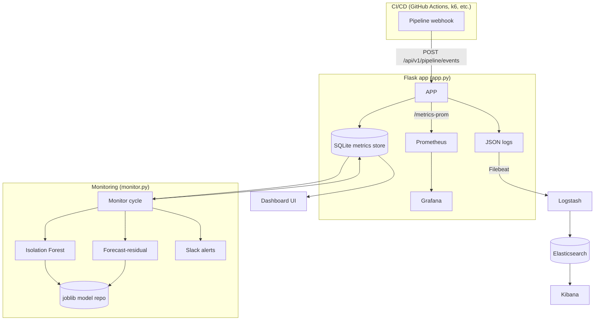

#  CerebrOps — AI-Powered CI/CD Monitoring

[](https://github.com/AnshulBari/CerebrOps/actions/workflows/ci-cd.yml)
[](https://opensource.org/licenses/MIT)

CerebrOps watches your CI/CD pipelines and application health, learns what "normal" looks like, and tells you — with context — when something is wrong. It combines real telemetry, two AI detectors, structured logging, and a polished web product into one self-hosted system.

>  **New here?** Read **[PROJECT_EXPLAINED.md](PROJECT_EXPLAINED.md)** — a beginner-friendly tour of the problem, our approach, the architecture, every module, the workflow, and the tech stack. The roadmap lives in **[ROADMAP.md](ROADMAP.md)**.

##  Highlights

- ** Two AI detectors** — an Isolation Forest model (v1) plus a seasonal forecast-residual detector (v2) that only activates after enough real history exists. Both refuse to guess when data is insufficient.
- ** Honest telemetry** — every metric, alert, and pipeline event lands in a SQLite store. No fabricated data anywhere; the dashboard starts from real webhooks.
- ** Alerts with a story** — anomalies include features, severity, correlated deploys, and optional LLM-generated summaries (opt-in), delivered to Slack.
- ** Premium web product** — a cinematic landing page (video hero), a real-time dashboard with auth (login/register/logout, lockout, password reset), and an interactive Three.js "experience" page.
- ** Fully observable** — structured JSON logs shipped to ELK, Prometheus `/metrics-prom` endpoint, provisioned Grafana dashboards, and SLO rules.
- ** Production-shaped** — session auth, API-key-gated webhooks, OIDC short-lived cloud credentials, GitOps via ArgoCD, and Kubernetes manifests validated by kubeconform + polaris in CI.

##  Architecture


```mermaid
flowchart TB
    subgraph CI["CI/CD (GitHub Actions, k6, etc.)"]
        GH[Pipeline webhook]
    end
    subgraph WEB["Flask app (app.py)"]
        GH -->|"POST /api/v1/pipeline/events"| APP
        APP --> STORE[(SQLite metrics store)]
        APP --> LOGS[JSON logs]
        APP -->|"/metrics-prom"| PROM[Prometheus]
        PROM --> GRAF[Grafana]
    end
    subgraph AI["Monitoring (monitor.py)"]
        MON[Monitor cycle] --> V1[Isolation Forest]
        MON --> V2[Forecast-residual]
        V1 & V2 --> MOD[(joblib model repo)]
        MON --> AL[Slack alerts]
    end
    STORE --> DASH[Dashboard UI]
    STORE --> MON
    MON --> STORE
    LOGS -->|Filebeat| LS[Logstash] --> ES[(Elasticsearch)] --> KI[Kibana]
```

**Key components**

| Component | File | Role |
|---|---|---|
| Web app + API | `app.py` | Landing/dashboard/experience pages, auth, v1 REST API, webhook ingestion, `/metrics-prom` |
| Telemetry store | `metrics_store.py` | SQLite persistence for metrics, alerts, pipeline events, users, lockouts |
| Monitor | `monitor.py` | Runs detection cycles; supports `--single-check` and `--interval` |
| v1 detector | `anomaly_detector.py` | Isolation Forest on engineered windows; drift-based retraining |
| v2 detector | `forecast_detector.py` | Seasonal forecast-residual; activates after ≥7 days of history |
| Model repository | `model_repository.py` | joblib persistence + versioned model cards |
| Root cause | `root_cause.py` | Correlates anomalies with deploys and SLO burn |
| Alerts | `alerts.py` | Slack delivery with severity and context |
| LLM summaries | `llm_summary.py` | Opt-in narrative summaries (mock mode for offline testing) |
| Logging | `logging_config.py` | Structured JSON logs with rotation |

##  Quick Start

**Prerequisites:** Python 3.11+, Docker (optional, for ELK/Grafana), kubectl (optional, for K8s).

```bash
# 1. Clone and install
git clone https://github.com/AnshulBari/CerebrOps.git
cd CerebrOps
python -m venv .venv
source .venv/bin/activate        # Windows: .venv\Scripts\activate
pip install -r requirements-dev.txt

# 2. Configure (optional — dev fallbacks exist for everything except production)
cp .env.example .env             # then edit as needed
# At minimum, set a session key:
#   CEREBROPS_SECRET_KEY=your-random-secret

# 3. Run the app
python app.py                    # → http://localhost:5000
```

Open **http://localhost:5000** — the landing page. Register an account (top-right) to reach the **dashboard** (`/dashboard`), and explore the Three.js **experience** page (`/experience`).

### Send a real pipeline event

The dashboard is only alive once real data flows. Post a webhook:

```bash
curl -X POST http://localhost:5000/api/v1/pipeline/events \
  -H 'Content-Type: application/json' \
  -d '{"status":"success","pipeline_id":"run-1842","stage":"deploy","duration":42,"branch":"main","commit_hash":"abc1234","source":"github-actions"}'
```

If `CEREBROPS_API_KEY` is set, add `-H 'X-API-Key: <key>'`. You'll get `202` with an `event_id`, and the event appears on the dashboard. The empty-state card on the dashboard shows the exact curl command with a copy button.

### Run the monitor

```bash
python monitor.py --single-check          # one detection pass
python monitor.py --interval 60           # continuous monitoring
python monitor.py --single-check --app-url http://localhost:5000 --slack-webhook https://hooks.slack.com/...
```

##  Configuration

All settings are environment variables (see `.env.example`). Key ones:

| Variable | Purpose | Default |
|---|---|---|
| `CEREBROPS_SECRET_KEY` | Session signing key — **required in production** (startup refuses the dev fallback) | dev-only fallback |
| `CEREBROPS_API_KEY` | API key for `/api/v1/*` and webhooks (optional) | unset = open |
| `CEREBROPS_DB_PATH` | SQLite telemetry store path | `data/cerebrops.db` |
| `CEREBROPS_MODEL_DIR` | Persisted models + model cards | `models/` |
| `CEREBROPS_AUTH_DISABLED` | `1` disables dashboard auth (dev/testing) | unset |
| `FLASK_ENV` / `CEREBROPS_ENV` | `development` \| `production` | `development` |
| `APP_URL` | Base URL the monitor checks | `http://localhost:5000` |
| `SLACK_WEBHOOK_URL` | Alert destination | unset = no alerts |
| `LOG_LEVEL` | Logging level | `INFO` |
| `ANOMALY_THRESHOLD` | Isolation Forest contamination | `0.1` |
| `RETRAIN_MIN_INTERVAL` / `RETRAIN_MAX_INTERVAL` | Drift-retraining bounds (s) | `3600` / `604800` |
| `FORECAST_MIN_HISTORY_DAYS` | v2 activation threshold | `7` |
| `LLM_API_URL` / `LLM_API_KEY` / `LLM_MODEL` | Opt-in LLM summaries | disabled |
| `LLM_MODE=mock` | Deterministic offline summaries | unset |

##  AI Anomaly Detection

Two detectors run against real windowed features (rolling mean/std/slope over 15m/1h/24h):

- **v1 — Isolation Forest** (`anomaly_detector.py`): unsupervised outlier detection over engineered features. Retrains on **drift** (feature-distribution shift beyond a threshold), not a fixed timer.
- **v2 — Forecast-residual** (`forecast_detector.py`): builds a seasonal profile per hour-of-week and flags points whose residual crosses a z-score band. Activates only once ≥7 days of real history exists.
- **Evaluation** (`scripts/evaluate_models.py`): labels real data for precision/recall. `--self-check` gates CI on synthetic labeled data; the meaningful number comes from ≥2 weeks of production labels (`--labels`).
- **Root cause** (`root_cause.py`): correlates anomalies with recent deploys and SLO burn so alerts carry "this looks like the deploy at 14:02" instead of just a number.

## 📡 Observability

- **Structured JSON logs** with rotation (`logging_config.py`) — shipped to **ELK** via `elk/docker-compose.yml` (Filebeat → Logstash → Elasticsearch → Kibana).
- **Prometheus** endpoint at `/metrics-prom`; `monitoring/` holds Prometheus config, SLO alert rules, and **provisioned Grafana dashboards**.
- **Verify end-to-end**: `scripts/verify-observability.sh` validates compose configs, and (with the Docker daemon up) boots the stack and asserts a tagged request's log line appears in Elasticsearch within 30s.
- **Runbooks** in `docs/runbooks/` cover incidents, restores, SLO burn, and model evaluation.

##  API

`/api/v1/*` endpoints are key-gated when `CEREBROPS_API_KEY` is set (`X-API-Key` header or `?api_key=`):

| Endpoint | Method | Purpose |
|---|---|---|
| `/api/v1/health` | GET | Service health |
| `/api/v1/metrics` | GET | Recent stored metrics |
| `/api/v1/anomalies` | GET | Recent anomaly detections |
| `/api/v1/alerts` | GET | Recent alerts |
| `/api/v1/pipeline` | GET | Pipeline event history |
| `/api/v1/pipeline/events` | POST | Ingest pipeline webhooks |
| `/health` | GET | Liveness (probes) |
| `/metrics-prom` | GET | Prometheus text format |
| `/logs` | GET | Recent structured log lines |
| `/simulate-error` | GET | Generate a 500 for testing observability |

See **[API_DOCUMENTATION.md](API_DOCUMENTATION.md)** for the full reference.

##  Testing

```bash
pytest tests/ -v --cov=. --cov-report=html   # full suite (currently 135 tests)
flake8 . --count --select=E9,F63,F7,F82      # strict lint gate (as run in CI)
```

The suite covers the store, both detectors, root cause, alerts, LLM summaries, backup/restore, model evaluation, auth flows (lockout, password reset, enumeration protection), and the web UI. CI also runs k6 performance tests and Trivy/CodeQL security scans.

##  CI/CD Pipeline

`.github/workflows/ci-cd.yml` — six jobs:

| Job | What it does |
|---|---|
| **Run Tests** | flake8 strict gate, pytest with coverage, coverage upload |
| **Build and Push** | Buildx → GHCR with semver/sha/`main` tags, digest output |
| **Security Scan + SBOM** | Trivy image scan, SBOM generation, CodeQL |
| **Validate Manifests** | kustomize render all overlays → kubeconform (strict, k8s 1.29) → polaris audit (fail on danger / score < 90) |
| **Deploy** (main only) | OIDC short-lived AWS creds → EKS, digest-pinned image, smoke tests |
| **Performance Testing** | k6 load tests |

`deploy/` holds ArgoCD Applications for GitOps promotion of `k8s/` (base + dev/staging overlays). See **[GITHUB_SETUP.md](GITHUB_SETUP.md)** for OIDC/secrets setup.

##  Deployment

```bash
# Docker
docker build -t cerebrops:latest .
docker run -d -p 5000:5000 --name cerebrops-app -e CEREBROPS_SECRET_KEY=... cerebrops:latest

# Kubernetes (kustomize)
kubectl apply -k k8s/                      # production (k8s/kustomization.yaml)
kubectl apply -k k8s/overlays/dev          # dev overlay
kubectl apply -k k8s/overlays/staging      # staging overlay

# Manual deploy script (env vars: NAMESPACE, IMAGE_TAG)
IMAGE_TAG=v1.2.3 NAMESPACE=cerebrops ./scripts/deploy.sh
```

The manifests are pinned to the real `main` image tag; CI rewrites it to the build **digest** at deploy time for reproducibility. See **[DEPLOYMENT_GUIDE.md](DEPLOYMENT_GUIDE.md)** and **[DEPLOYMENT_CHECKLIST.md](DEPLOYMENT_CHECKLIST.md)**.

##  Project Structure

```
CerebrOps/
├── app.py                  # Flask app, auth, API, webhooks
├── monitor.py              # monitoring orchestrator
├── anomaly_detector.py     # v1 Isolation Forest
├── forecast_detector.py    # v2 forecast-residual
├── metrics_store.py        # SQLite telemetry store
├── model_repository.py     # joblib models + model cards
├── root_cause.py           # deploy/SLO correlation
├── alerts.py               # Slack alerts
├── llm_summary.py          # opt-in LLM summaries
├── logging_config.py       # structured JSON logging
├── static/                 # css/ js/ vendor/ (Three.js, Chart.js)
├── templates/              # landing, dashboard, experience, auth pages
├── k8s/                    # kustomize base/ + overlays/
├── deploy/                 # ArgoCD applications
├── monitoring/             # Prometheus + Grafana provisioning
├── elk/                    # ELK stack (compose + configs)
├── scripts/                # backup, restore drill, evaluation, deploy, observability verify
├── tests/                  # 135 tests across all modules
└── docs/runbooks/          # incident, restore, SLO, model-evaluation runbooks
```

##  Documentation

| Document | What it covers |
|---|---|
| [PROJECT_EXPLAINED.md](PROJECT_EXPLAINED.md) | Beginner-friendly deep dive: problem, approach, architecture, workflow, stack |
| [ROADMAP.md](ROADMAP.md) | The phase-by-phase plan and current status |
| [QUICKSTART.md](QUICKSTART.md) | Fast local setup |
| [DEPLOYMENT_GUIDE.md](DEPLOYMENT_GUIDE.md) | Production deployment walkthrough |
| [GITHUB_SETUP.md](GITHUB_SETUP.md) | OIDC, secrets, registry, ArgoCD setup |
| [API_DOCUMENTATION.md](API_DOCUMENTATION.md) | Full v1 API reference |
| [OPERATIONS_MANUAL.md](OPERATIONS_MANUAL.md) | Day-to-day operations |
| [QUICK_REFERENCE.md](QUICK_REFERENCE.md) | Cheat sheet for common tasks |
| [SETUP_COMPLETE.md](SETUP_COMPLETE.md) | Post-setup verification checklist |
| [docs/runbooks/](docs/runbooks/) | Incident response, restore drill, SLO burn, model evaluation |

##  Status

Phases 0–5 of the roadmap are implemented: real-data telemetry store, ELK + Grafana observability, both AI detectors with drift retraining, the product dashboard + API + auth, CI/CD & K8s hardening (OIDC, kustomize, kubeconform/polaris gates, HPA/PDB/NetworkPolicy), and the ops layer (runbooks, SLOs, backup/restore drills, LLM summaries).

**What remains is what only production can provide:** ≥2 weeks of real labeled traffic for the precision/recall number, and the first live-cluster `kubectl apply` — the manifests are schema- and policy-validated, but a real cluster is the final proof.

##  Contributing

1. Fork the repo, create a feature branch (`git checkout -b feature/...`).
2. Make changes **with tests** — the suite must stay green (`pytest tests/`), flake8 strict pass must be clean, and K8s changes should render + pass `kubeconform`/`polaris`.
3. Use [conventional commits](https://www.conventionalcommits.org/): `feat:`, `fix:`, `docs:`, `test:`, `refactor:`.
4. Open a pull request.

## 📄 License

MIT — see [LICENSE](LICENSE).

---

**built by [anshul bari](https://www.anshulbari.me/)** · *Empowering DevOps with Artificial Intelligence*
